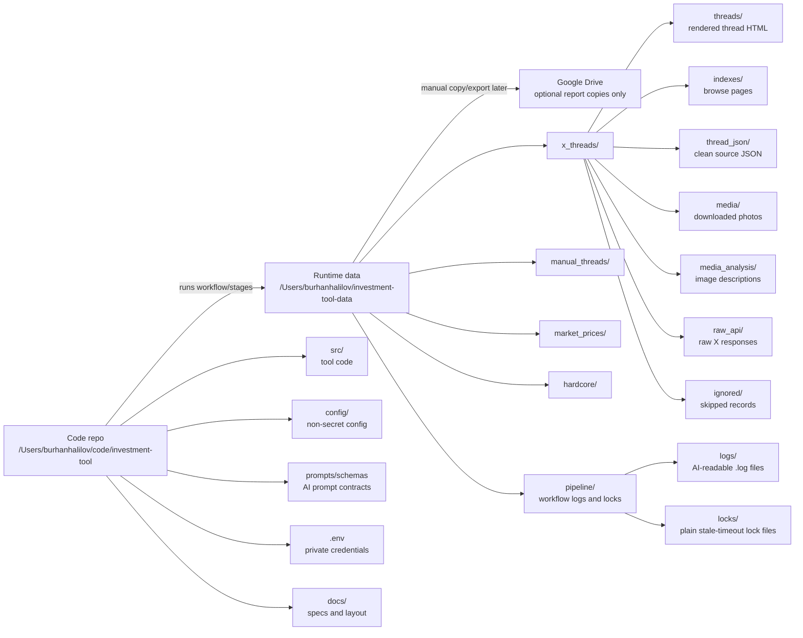

# Storage Layout

The project is split into two clean places:

- Code lives in `/Users/burhanhalilov/code/investment-tool`
- Runtime data lives in `/Users/burhanhalilov/investment-tool-data`

Use the code repo as the workspace. Do not use the runtime data folder as the
workspace for code changes.

Google Drive stays out of the live workflow. If reports need to be shared later,
copy only finished report files there.

## Repo Files

| Location | Purpose | Keep in Git? |
| --- | --- | --- |
| `/Users/burhanhalilov/code/investment-tool/src` | Tool code | Yes |
| `/Users/burhanhalilov/code/investment-tool/config` | Non-secret source/rule/ticker config | Yes |
| `/Users/burhanhalilov/code/investment-tool/prompts` | AI prompt files | Yes |
| `/Users/burhanhalilov/code/investment-tool/schemas` | AI output schemas | Yes |
| `/Users/burhanhalilov/code/investment-tool/docs` | Current specs and layout docs | Yes |
| `/Users/burhanhalilov/code/investment-tool/.env` | X, OpenAI, email, and other credentials; never print or commit | No |

## Runtime Data

| Location | Purpose | Keep in Git? |
| --- | --- | --- |
| `/Users/burhanhalilov/investment-tool-data/x_threads/raw_api` | Raw X API evidence by run | No |
| `/Users/burhanhalilov/investment-tool-data/x_threads/thread_json` | Clean X thread source records | No |
| `/Users/burhanhalilov/investment-tool-data/x_threads/media` | Downloaded X photos/screenshots | No |
| `/Users/burhanhalilov/investment-tool-data/x_threads/media_analysis` | One image-description JSON per media key | No |
| `/Users/burhanhalilov/investment-tool-data/x_threads/threads` | Rendered HTML pages | No |
| `/Users/burhanhalilov/investment-tool-data/x_threads/indexes` | Browse indexes | No |
| `/Users/burhanhalilov/investment-tool-data/x_threads/ignored` | Skipped records for inspection | No |
| `/Users/burhanhalilov/investment-tool-data/manual_threads/inbox` | Manual screenshot inbox for scheduled import | No |
| `/Users/burhanhalilov/investment-tool-data/manual_threads` | Imported/reconstructed manual screenshot bundles | No |
| `/Users/burhanhalilov/investment-tool-data/market_prices/daily_ohlcv` | Daily OHLCV bars | No |
| `/Users/burhanhalilov/investment-tool-data/market_prices/hourly_7d` | Hourly recent bars | No |
| `/Users/burhanhalilov/investment-tool-data/market_prices/intraday_15m_48h` | Rolling 15-minute recent bars | No |
| `/Users/burhanhalilov/investment-tool-data/hardcore` | HC/Ghost article JSON and evidence | No |
| `/Users/burhanhalilov/investment-tool-data/pipeline/logs` | Plain AI-readable workflow logs | No |
| `/Users/burhanhalilov/investment-tool-data/pipeline/locks` | Plain workflow lock files | No |

## Current Spec Docs

- `docs/pipeline-orchestrator-plan.md` defines the workflow/orchestrator design.
- `docs/ai-vector-pass-design.md` defines postponed AI/vector decisions.
