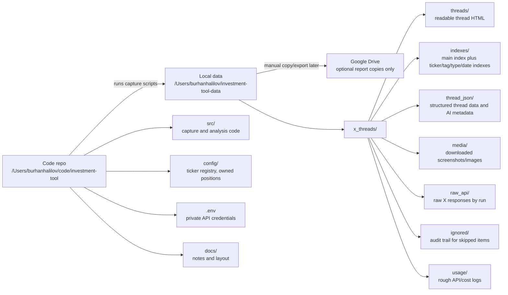

# Storage Layout

The project is split into two clean places:

- Code lives in `/Users/burhanhalilov/code/investment-tool`
- Runtime data lives in `/Users/burhanhalilov/investment-tool-data`

## What Each Folder Means

| Location | Purpose | Keep in Git? |
| --- | --- | --- |
| `/Users/burhanhalilov/code/investment-tool/src` | The actual tool code | Yes |
| `/Users/burhanhalilov/code/investment-tool/config` | Local ticker/position config | Yes for non-secret config |
| `/Users/burhanhalilov/code/investment-tool/.env` | X, OpenAI, email, and other credentials | No |
| `/Users/burhanhalilov/investment-tool-data/x_threads/threads` | One readable HTML page per captured thread | No |
| `/Users/burhanhalilov/investment-tool-data/x_threads/indexes` | Browse pages: all threads, ticker pages, tags, type, daily | No |
| `/Users/burhanhalilov/investment-tool-data/x_threads/thread_json` | Stored thread records, AI output, fingerprints, source post data | No |
| `/Users/burhanhalilov/investment-tool-data/x_threads/media` | Downloaded X images/screenshots | No |
| `/Users/burhanhalilov/investment-tool-data/x_threads/raw_api` | Raw API evidence for each run | No |
| `/Users/burhanhalilov/investment-tool-data/x_threads/ignored` | Skipped/irrelevant items, kept for audit | No |
| `/Users/burhanhalilov/investment-tool-data/x_threads/usage` | Rough X/OpenAI usage and cost logs | No |

Google Drive should stay out of the live workflow. If reports need to be shared later, copy only finished report files there.
