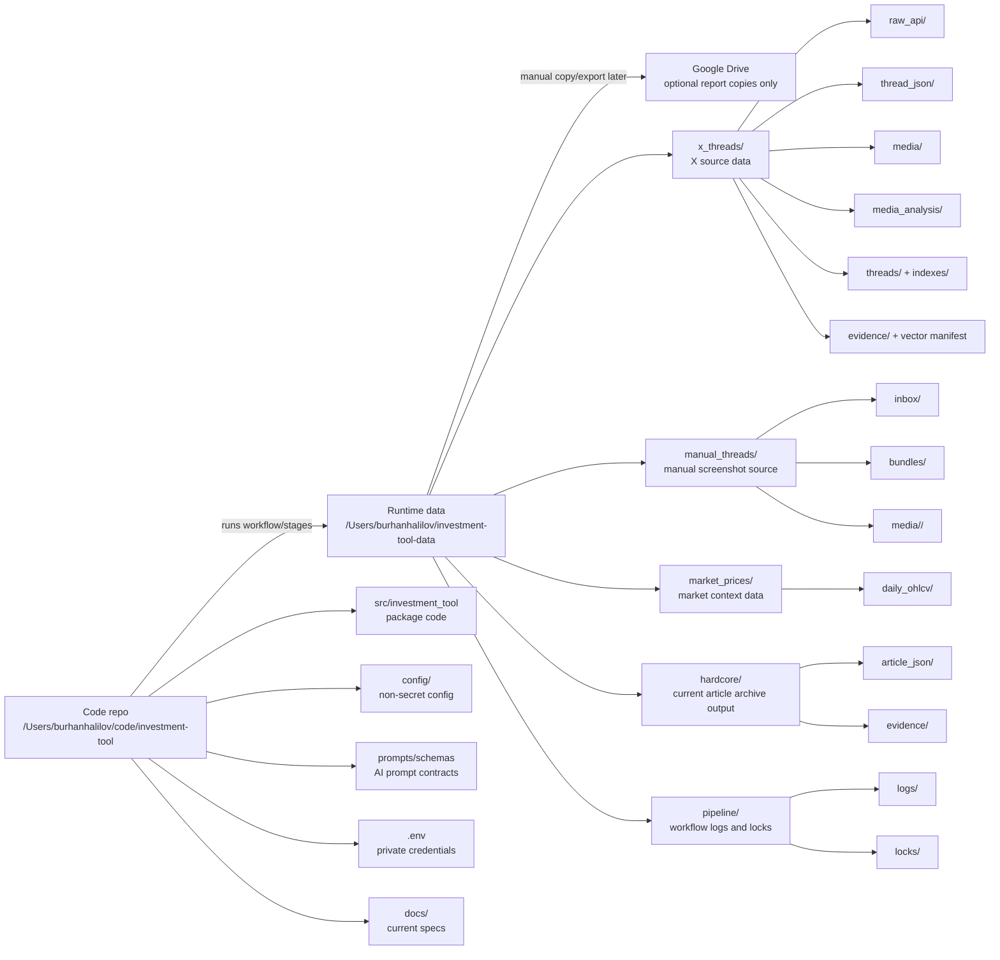

# Storage Layout

This document describes current code and runtime storage truth after the locked
package refactor. It is a storage map, not a migration plan.

The project is split into two clean places:

- Code lives in `/Users/burhanhalilov/code/investment-tool`
- Runtime data lives in `/Users/burhanhalilov/investment-tool-data`

Use the code repo as the workspace. Do not use the runtime data folder as the
workspace for code changes.

Google Drive stays out of the live workflow. If reports need to be shared later,
copy only finished report files there.

Runtime data must not be committed to Git. `.env` must not be printed or
committed.

## Current Shape

## Repo Package Layout

| Location | Purpose | Keep in Git? |
| --- | --- | --- |
| `/Users/burhanhalilov/code/investment-tool/src/investment_tool/cli` | Public and compatibility command entrypoints | Yes |
| `/Users/burhanhalilov/code/investment-tool/src/investment_tool/workflow` | Coordinate-only workflow runner, stage planning, logs, locks, checks | Yes |
| `/Users/burhanhalilov/code/investment-tool/src/investment_tool/runtime` | Env, config, and shared reporting helpers | Yes |
| `/Users/burhanhalilov/code/investment-tool/src/investment_tool/sources` | Source-specific capture/ingest code for X, articles, and screenshots | Yes |
| `/Users/burhanhalilov/code/investment-tool/src/investment_tool/context` | Supporting context data jobs, currently prices and image descriptions | Yes |
| `/Users/burhanhalilov/code/investment-tool/src/investment_tool/analysis` | Shared AI API helpers and future expensive AI passes | Yes |
| `/Users/burhanhalilov/code/investment-tool/src/investment_tool/retrieval` | Legacy vector/action server code and future retrieval memory | Yes |
| `/Users/burhanhalilov/code/investment-tool/src/investment_tool/presentation` | HTML thread pages and indexes | Yes |
| `/Users/burhanhalilov/code/investment-tool/src/investment_tool/rules` | Source-neutral ticker parsing and filtering | Yes |
| `/Users/burhanhalilov/code/investment-tool/src/investment_tool/records` | Canonical internal record shapes placeholder | Yes |
| `/Users/burhanhalilov/code/investment-tool/config` | Non-secret source, rule, ticker, model, and pipeline config | Yes |
| `/Users/burhanhalilov/code/investment-tool/prompts` | AI prompt files | Yes |
| `/Users/burhanhalilov/code/investment-tool/schemas` | AI output schemas | Yes |
| `/Users/burhanhalilov/code/investment-tool/docs` | Current specs and layout docs | Yes |
| `/Users/burhanhalilov/code/investment-tool/scripts` | Thin compatibility launchers or disposable probes only | Yes |
| `/Users/burhanhalilov/code/investment-tool/.env` | X, OpenAI, market-data, and other credentials | No |

Compatibility wrappers remain at old top-level module paths such as
`capture_threads.py`, `market_prices.py`, and `vector_store_sync.py`. They exist
only to keep old imports and direct commands working during the transition. New
code should import from the locked package folders above.

## Runtime Data

The default runtime root is `/Users/burhanhalilov/investment-tool-data`.
Commands may override it with `INVESTMENT_TOOL_DATA_DIR`. Source configs can
also point source-specific jobs at fixed runtime subfolders, for example X uses
`/Users/burhanhalilov/investment-tool-data/x_threads` and article ingest
currently writes to `/Users/burhanhalilov/investment-tool-data/hardcore`.

| Location | Current owner/stage | Purpose | Keep in Git? |
| --- | --- | --- | --- |
| `/Users/burhanhalilov/investment-tool-data/x_threads/raw_api` | `x-capture`, `x-raw` | Saved X API responses by run, used for rebuild without another X pull | No |
| `/Users/burhanhalilov/investment-tool-data/x_threads/thread_json` | `x-capture`, `x-raw` | Clean X thread source records | No |
| `/Users/burhanhalilov/investment-tool-data/x_threads/media` | `x-capture` | Downloaded X photo/image media only; videos/GIFs are placeholders in records | No |
| `/Users/burhanhalilov/investment-tool-data/x_threads/media_analysis` | `descriptions` | One OCR/visual-description JSON per media key | No |
| `/Users/burhanhalilov/investment-tool-data/x_threads/threads` | `render`, legacy X job modes | Rendered local thread HTML pages | No |
| `/Users/burhanhalilov/investment-tool-data/x_threads/indexes` | `render`, legacy X job modes | Browse indexes plus `current_owned.json` browser-only ticker-color snapshot | No |
| `/Users/burhanhalilov/investment-tool-data/x_threads/ignored` | `x-capture`, `x-raw`, `render` | Skipped/ignored thread records for inspection | No |
| `/Users/burhanhalilov/investment-tool-data/x_threads/rebuild_staging` | `x-raw` | Temporary staged rebuilt thread JSON before optional replacement | No |
| `/Users/burhanhalilov/investment-tool-data/x_threads/cleanup_backups` | X maintenance | Backups created by cleanup/repair jobs | No |
| `/Users/burhanhalilov/investment-tool-data/x_threads/evidence` | `retrieval/legacy` | Legacy Markdown evidence generated from thread JSON | No |
| `/Users/burhanhalilov/investment-tool-data/x_threads/vector_store_sync_manifest.json` | `retrieval/legacy` | Legacy vector sync manifest | No |
| `/Users/burhanhalilov/investment-tool-data/manual_threads/inbox` | `screenshots` | Manual screenshot inbox for scheduled import/reconstruction | No |
| `/Users/burhanhalilov/investment-tool-data/manual_threads/bundles` | `screenshots` | Imported manual screenshot bundle JSON | No |
| `/Users/burhanhalilov/investment-tool-data/manual_threads/media/<bundle_id>` | `screenshots` | Copied screenshot image files grouped by bundle | No |
| `/Users/burhanhalilov/investment-tool-data/market_prices/daily_ohlcv` | `prices` | Current implemented daily USD-normalized OHLCV bars | No |
| `/Users/burhanhalilov/investment-tool-data/market_prices/manifest.json` | `prices` | Current price sync manifest | No |
| `/Users/burhanhalilov/investment-tool-data/hardcore/article_json` | `articles` | Current article JSON output; folder name is legacy/source-specific storage | No |
| `/Users/burhanhalilov/investment-tool-data/hardcore/evidence` | `articles` | Current article Markdown evidence output | No |
| `/Users/burhanhalilov/investment-tool-data/hardcore/manifest.json` | `articles` | Current article ingest manifest | No |
| `/Users/burhanhalilov/investment-tool-data/pipeline/logs` | `workflow` | Plain AI-readable workflow run logs, including `latest.log` | No |
| `/Users/burhanhalilov/investment-tool-data/pipeline/locks` | `workflow` | Plain stale-timeout lock files | No |

## Planned But Not Current

The market-data design calls for recent hourly and 15-minute bars, but the
current implemented price code writes only `market_prices/daily_ohlcv` and
`market_prices/manifest.json`.

Planned folders:

- `/Users/burhanhalilov/investment-tool-data/market_prices/hourly_7d`
- `/Users/burhanhalilov/investment-tool-data/market_prices/intraday_15m_48h`

Do not treat these planned folders as current outputs until the `prices` stage
implements them.

## Transitional Notes

- The workflow design separates `x-capture` from `render`, but the legacy X job
  adapter can still render HTML and indexes during direct legacy capture modes.
- `retrieval/legacy` remains available for old evidence/vector workflows, but
  it is not the finalized AI/vector architecture.
- `/Users/burhanhalilov/investment-tool-data/hardcore` is the current configured
  article output folder. The package code is generic under `sources/articles`;
  the runtime folder name is legacy/source-specific storage.
- `indexes/current_owned.json` is browser UI state for dynamic owned-ticker
  coloring. It should not be treated as thread evidence for AI/vector ingestion.

## Current Spec Docs

- `docs/pipeline-orchestrator-plan.md` defines the workflow/orchestrator design.
- `docs/ai-vector-pass-design.md` defines postponed AI/vector decisions.
- `docs/code-organization-spec.md` defines the locked package hierarchy.
